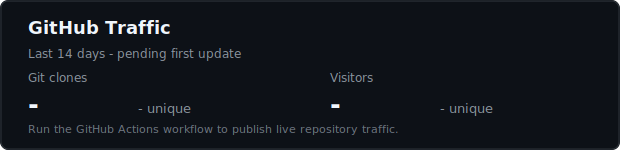

# Generate Code Skill

这个仓库封装了一套给 Codex 和 Claude 共用的代码生成工作流 skill。

## 目录结构

- `SKILL.md`：Codex 的 skill 入口
- `References/`：Codex 按需加载的参考文件
- `CLAUDE.md`：Claude 的项目级说明
- `.claude/skills/generate-code/`：Claude 的 skill 入口
- `agents/openai.yaml`：Codex 的界面元数据
- `scripts/check-sync.ps1`：Codex/Claude 双份文件同步检查脚本

## 使用方式

给 Codex 使用时，直接把这个仓库作为 skill 来源，并读取 `SKILL.md`。
给 Claude 使用时，保留仓库根目录可见，让 `CLAUDE.md` 和 `.claude/skills/generate-code/` 可被发现。

## 同步检查

运行以下命令检查 Codex 和 Claude 两套 skill 文件是否漂移：

```powershell
powershell -ExecutionPolicy Bypass -File .\scripts\check-sync.ps1
```

## 背景


## GitHub Traffic



统计由 GitHub Actions 每 6 小时自动更新一次，展示最近 14 天的 git clones 和 visitors。
需要在仓库 Secrets 中配置有 repository traffic 读取权限的 `TRAFFIC_TOKEN`。

## 注意事项

- `SKILL.md`、`References/`、`CLAUDE.md` 和 `.claude/skills/generate-code/` 要保持同步。
- 不要提交密钥、token 或本机专属路径。
