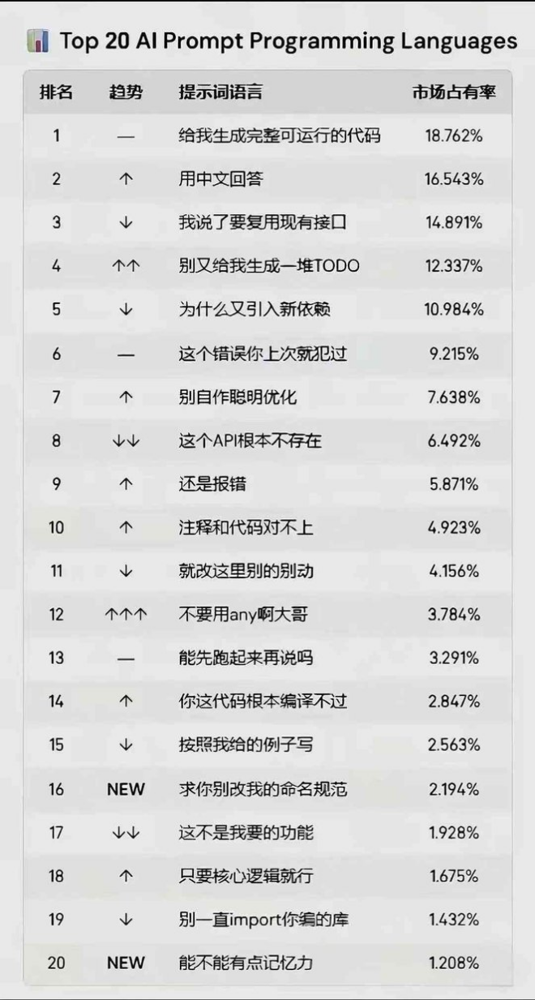

# Generate Code Skill

这个仓库封装了一套给 Codex 和 Claude 共用的代码生成工作流 skill。

## 目录结构

- `SKILL.md`：Codex 的 skill 入口
- `References/`：Codex 按需加载的参考文件
- `CLAUDE.md`：Claude 的项目级说明
- `.claude/skills/generate-code/`：Claude 的 skill 入口
- `agents/openai.yaml`：Codex 的界面元数据

## 使用方式

给 Codex 使用时，直接把这个仓库作为 skill 来源，并读取 `SKILL.md`。
给 Claude 使用时，保留仓库根目录可见，让 `CLAUDE.md` 和 `.claude/skills/generate-code/` 可被发现。

## Background

## 注意事项

- `SKILL.md`、`References/`、`CLAUDE.md` 和 `.claude/skills/generate-code/` 要保持同步。
- 不要提交密钥、token 或本机专属路径。
